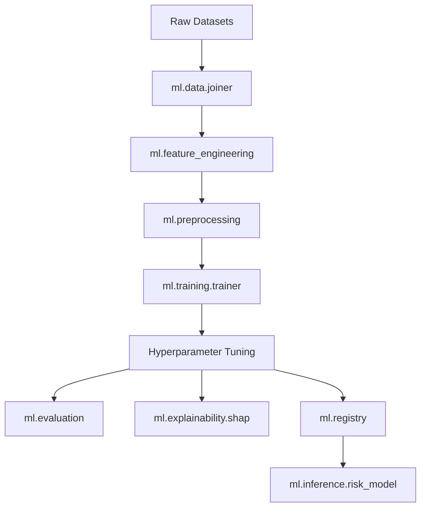

# Machine Learning Architecture for NIRNAY

## Objective
The objective of the NIRNAY ML Pipeline is NOT traditional fraud detection. Instead, it is an advanced Decision Intelligence engine designed to calculate the probability that a customer is making an **unsafe financial decision** before completing an authorized transaction.

This probability risk score (0-100) directly drives the downstream LangGraph Agentic workflows.

## Pipeline Architecture

The pipeline is fully modular, adhering to production MLOps standards.

## Key Components

### 1. Data Joiner (`ml.data`)
Aggregates 9 synthetic datasets from Phase 1, linking transactions to user behavior baselines, recipient history, and merchant reputation scores.

### 2. Feature Engineer (`ml.feature_engineering`)
A reusable, deterministic pipeline that transforms raw entities into ML-ready features (e.g. `amount_deviation`, `balance_ratio`, `is_favorite_category`). 

### 3. Preprocessor (`ml.preprocessing`)
Scikit-Learn `ColumnTransformer` applying:
- `StandardScaler` for continuous numerical features.
- `OneHotEncoder` for low-cardinality categoricals (Transaction Type, Channel).
- `SimpleImputer` for handling any absent data robustly during real-time inference.

### 4. Trainer (`ml.training`)
Trains and cross-validates multiple models:
- Logistic Regression (Baseline)
- Random Forest
- XGBoost (Primary)
- LightGBM
Performs RandomizedSearchCV to optimize hyperparameters for the best-performing model based on ROC-AUC.

### 5. Explainability (`ml.explainability`)
Uses SHAP (SHapley Additive exPlanations) to:
- Generate global feature importance across the dataset.
- Provide real-time local explanations for a single transaction (used by the LangGraph agents to justify interventions).

### 6. Inference Engine (`ml.inference`)
The production wrapper. It accepts a raw, flattened JSON payload (similar to an API request), runs it through the full pipeline (FE -> Preprocessing -> Model -> SHAP), and outputs a structured Risk Decision block containing the Risk Level (Very Low to Critical) and the Recommended Action.
